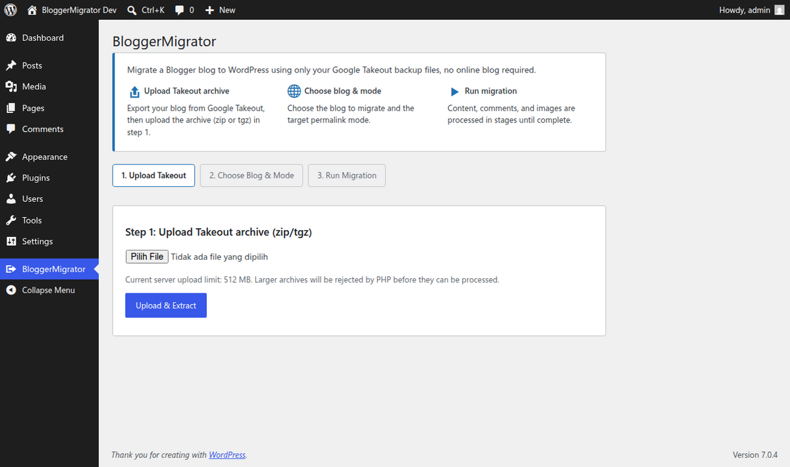
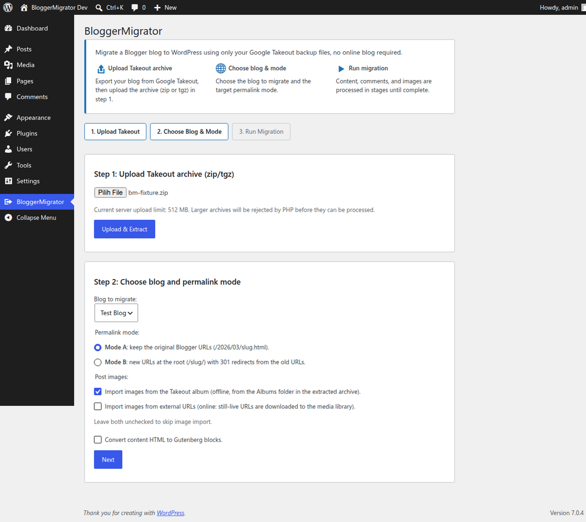
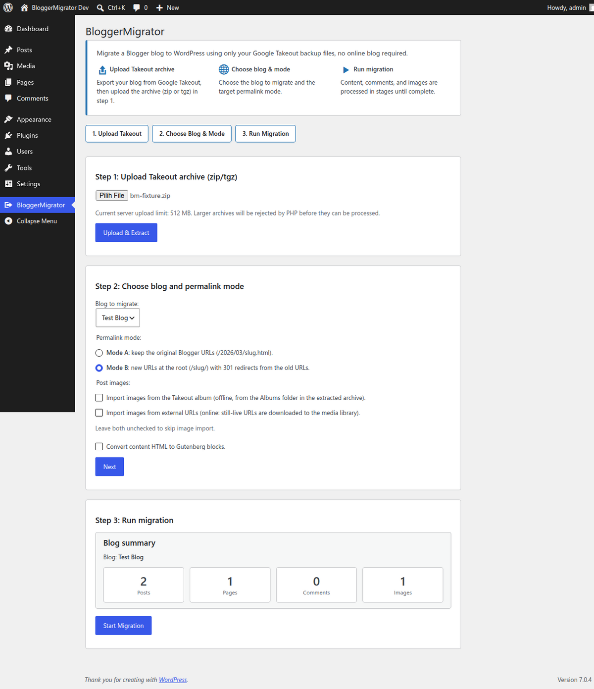
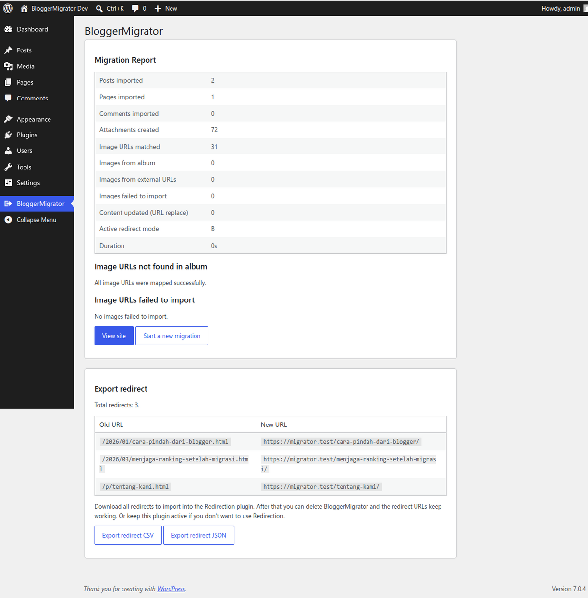

# Sugeng Offline Migrator for Blogger

Migrate a Blogger blog to WordPress **offline** from Google Takeout. Content, images, comments, and 301 redirects from your backup, no online blog needed.

Unlike importers that require your old blog to stay online, Sugeng Offline Migrator for Blogger works fully offline: blogs that were deleted or locked can still be migrated.

## Features

- Import posts, pages, threaded comments, drafts, and labels from the Takeout `feed.atom`
- Restore original Blogger slugs and URLs from the `b:filename` metadata
- Two image options that can be combined: offline import from the Takeout Albums folder, and/or download of still-live external URLs to the media library, with automatic URL rewriting inside content
- Two permalink modes:
  - **Mode A** keeps the original Blogger URLs (`/2026/03/slug.html`)
  - **Mode B** uses new root URLs (`/slug/`) with automatic 301 redirects from the old URLs
- Redirect export (CSV/JSON) compatible with the [Redirection](https://wordpress.org/plugins/redirection/) plugin. In Mode A the export includes pages plus posts whose old URL would no longer match their date-based permalink.
- Optional conversion of content HTML to Gutenberg blocks
- Accepts `.zip` and `.tgz` Takeout archives
- Chunked AJAX upload: large archives are split into small parts and reassembled server-side, so files larger than the host's `upload_max_filesize` still upload successfully
- Chunked AJAX processing, safe for large feeds on shared hosting
- Resumable jobs without content duplication

## Requirements

- WordPress 6.2+
- PHP 7.4+

## Installation

1. Upload the `sugeng-offline-migrator-for-blogger` folder to `/wp-content/plugins/`, or install the zip via Plugins → Add New → Upload.
2. Activate the plugin.
3. Open **Tools → Sugeng Offline Migrator for Blogger** in your dashboard.
4. Upload your Google Takeout archive (zip or tgz), choose the blog and permalink mode, then run the migration.

To get the Takeout file: open [Google Takeout](https://takeout.google.com/), select the Blogger product, export, then download the archive in zip or tgz format.

## Usage

The wizard guides you through three steps: upload the archive, pick the blog and permalink mode, then run the migration. Processing is chunked via AJAX with a live progress bar; if a batch fails you can reload the page and continue the job from where it left off.

After the migration, the report screen shows what was imported (posts, pages, comments, attachments, images) and the Export redirect section lists every old-to-new URL pair. Download the CSV/JSON export if you plan to manage redirects with the Redirection plugin and remove Sugeng Offline Migrator for Blogger afterwards.

## Translations

When hosted on WordPress.org, translations are distributed automatically through translate.wordpress.org. UI strings default to English; sites running another locale receive the matching translation. Indonesian translations can be contributed via translate.wordpress.org.

## Screenshots

| | |
|---|---|
|  |  |
|  |  |

## License

GPL-2.0-or-later — see [LICENSE](LICENSE).

Made by [Sugeng.id](https://sugeng.id).